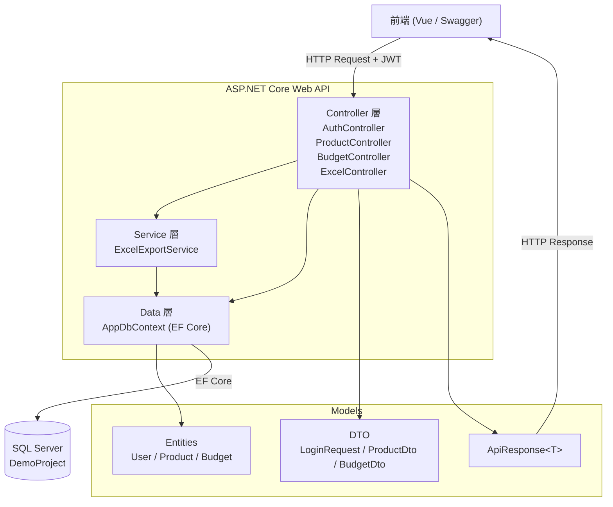

# 系統架構圖

## 整體架構



---

## 分層說明

| 層 | 職責 |
|---|---|
| **Controller** | 接收 HTTP 請求、驗證輸入、回傳結果，不含業務邏輯 |
| **Service** | 業務邏輯處理（目前為 Excel 產生） |
| **Data** | EF Core DbContext，負責所有資料庫操作 |
| **Entity** | 對應資料庫資料表的實體類別 |
| **DTO** | 控制 API 傳入／傳出的資料格式，避免直接暴露 Entity |
| **ApiResponse** | 統一所有 API 的回應格式 |

---

## 統一回應格式

所有 API 皆回傳以下格式：

```json
{
  "success": true,
  "message": "成功",
  "data": { }
}
```
