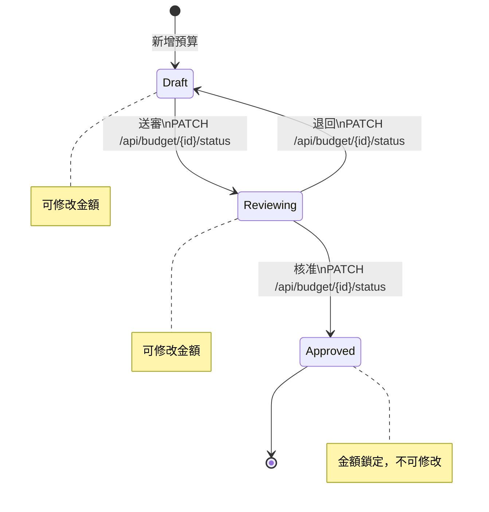
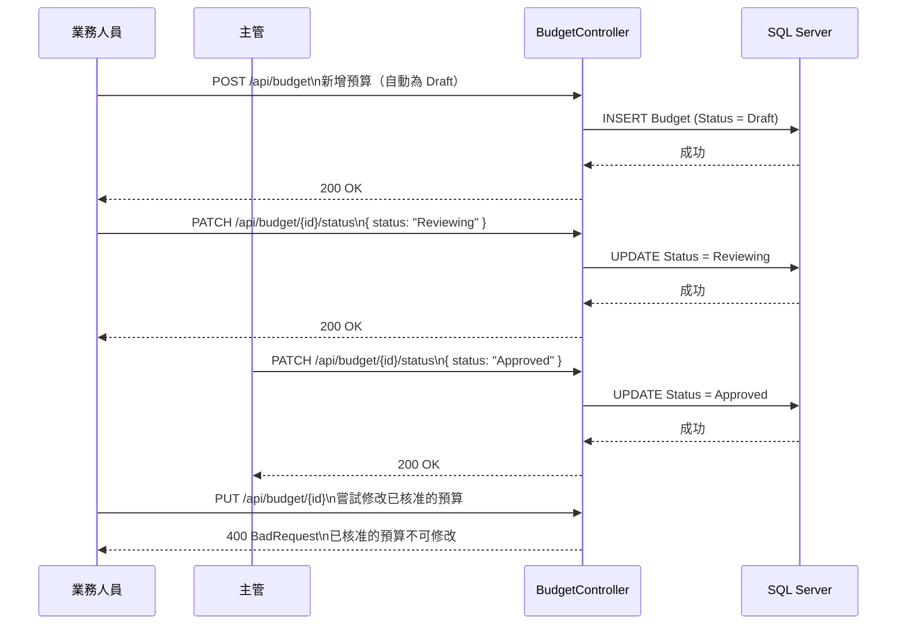

# 預算審核流程

## 狀態流程圖

---

## 各狀態說明

| 狀態 | 說明 | 可修改金額 |
|------|------|-----------|
| `Draft` | 草稿，剛建立或被退回 | ✅ |
| `Reviewing` | 審核中，已送出等待核准 | ✅ |
| `Approved` | 已核准，金額鎖定 | ❌ |

---

## API 操作流程

---

## DTO 設計說明

| DTO | 用途 | 包含欄位 |
|-----|------|---------|
| `BudgetDto` | 新增／更新預算時前端傳入 | Brand、Channel、Year、Month、BudgetAmount、ActualAmount |
| `UpdateBudgetStatusDto` | 審核狀態變更時前端傳入 | Status |

> `Status` 不包含在 `BudgetDto` 內，確保狀態只能透過審核 API 依流程變更，避免前端任意設定狀態。
