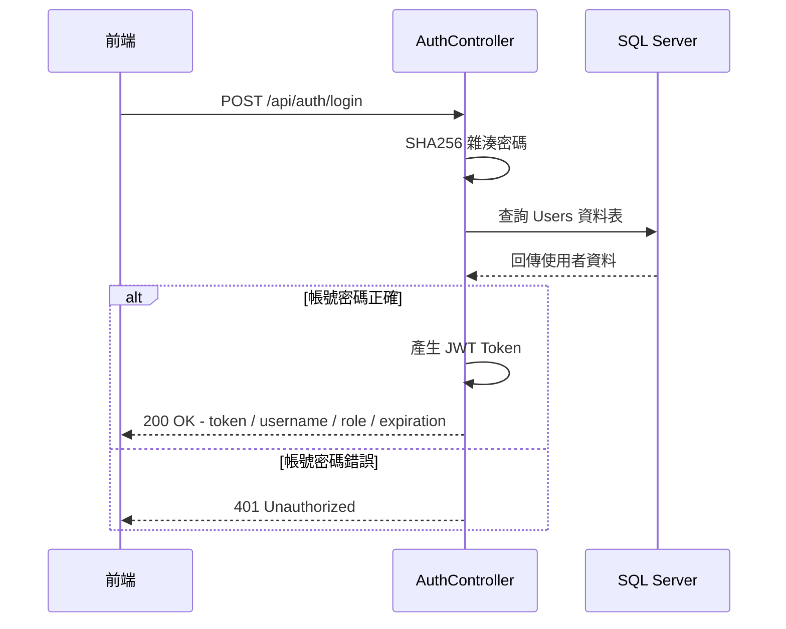
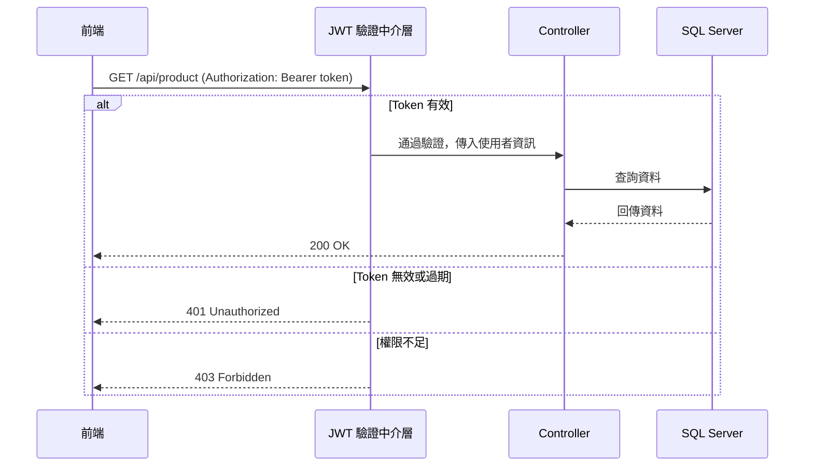

# JWT 驗證流程

## 登入取得 Token



---

## 攜帶 Token 呼叫 API



---

## JWT Token 結構

```
eyJhbGciOiJIUzI1NiJ9  .  eyJuYW1lIjoiYWRtaW4ifQ  .  簽章
──────────────────────    ───────────────────────    ────
       Header                     Payload            Signature
   （加密演算法）              （使用者資訊）           （防偽）
```

### Payload 內容

| 欄位 | 說明 |
|------|------|
| `ClaimTypes.Name` | 使用者名稱 |
| `ClaimTypes.Role` | 角色（Admin / User） |
| `exp` | 過期時間（60 分鐘） |
| `iss` | 發行者（DemoProject） |
| `aud` | 接收者（DemoProject） |

---

## 角色權限對照

| API | User | Admin |
|-----|------|-------|
| 登入 | ✅ | ✅ |
| 查詢商品 | ✅ | ✅ |
| 新增／更新商品 | ✅ | ✅ |
| **刪除商品** | ❌ | ✅ |
| 查詢預算 | ✅ | ✅ |
| 新增／更新預算 | ✅ | ✅ |
| 匯出 Excel | ✅ | ✅ |
